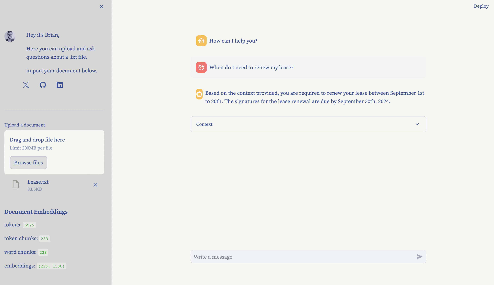

# Text Similarity Search
This code implements a chat-app with text similarity search for querying a document. Think of it as an upgrded Cmd+F search. It's written in [Pure Python](https://github.com/BrianLesko/text-similarity-search/blob/main/app.py). Created for Learning Purposes.

&nbsp;

<div align="center"></div>

&nbsp;

## Dependencies

This code uses the following libraries:
- `streamlit`: for building the user interface.
- `openai`: for generating responses to user questions.
- `tiktoken`: for tokenizing text
- `scikit-learn`: for finding the relevant text chunks based on a user's question.
- `numpy`: for creating arrays
- `pandas`: for creating dataframes

&nbsp;
## Usage

To run this code, you need an OpenAI API Key. You can get an OpenAI API key by creating an account on the OpenAI website. Copy it to your clipboard and paste it into the app once its running. All the dependencies are handled automatically from the requirements.txt file

Then, run the following command:
```
pip install --upgrade streamlit
streamlit run https://github.com/BrianLesko/text-similarity-search/blob/main/app.py
```

This will start the Streamlit server, and you can access the chatbot by opening a web browser and navigating to `http://localhost:8501`.

&nbsp;
## How it Works

The chatbot works as follows:
1. The user enters a question in the input field.
2. The chatbot retrieves relevant text chunks based on the user's question using scikit-learn cosine similarity search.
3. The chatbot adds the user's question to the retrieved text chunks to create an augmented query.
4. The chatbot generates a response to the augmented query using OpenAI's GPT-3.5 (Chat GPT) language model.
5. The chatbot displays the response to the user, along with the chat history.

The chat history is saved in the `st.session_state` dictionary, which is a dictionary that persists across Streamlit sessions.

&nbsp;
## Repository Structure
```
doc-chat/
├── .streamlit/
│   └── config.toml # theme info for the UI
├── docs/
│   └── content.png
├── app.py # the code and UI integrated together live here
├── about.py # for the UI
├── requirements.txt # the python packages needed to run locally
└── .gitignore # includes the api key file and the local virtual environment
```

&nbsp;

## Topics 
```
Python | Streamlit | Git | Low Code UI
Template Repository | Chat interface | LLM
Text similarity | Text embeddings | Cosine Similarity 
Sklearn | OpenAI
```
&nbsp;

<hr>

&nbsp;

<div align="center">


╭━━╮╭━━━┳━━┳━━━┳━╮╱╭╮        ╭╮╱╱╭━━━┳━━━┳╮╭━┳━━━╮
┃╭╮┃┃╭━╮┣┫┣┫╭━╮┃┃╰╮┃┃        ┃┃╱╱┃╭━━┫╭━╮┃┃┃╭┫╭━╮┃
┃╰╯╰┫╰━╯┃┃┃┃┃╱┃┃╭╮╰╯┃        ┃┃╱╱┃╰━━┫╰━━┫╰╯╯┃┃╱┃┃
┃╭━╮┃╭╮╭╯┃┃┃╰━╯┃┃╰╮┃┃        ┃┃╱╭┫╭━━┻━━╮┃╭╮┃┃┃╱┃┃
┃╰━╯┃┃┃╰┳┫┣┫╭━╮┃┃╱┃┃┃        ┃╰━╯┃╰━━┫╰━╯┃┃┃╰┫╰━╯┃
╰━━━┻╯╰━┻━━┻╯╱╰┻╯╱╰━╯        ╰━━━┻━━━┻━━━┻╯╰━┻━━━╯
  


&nbsp;


<a href="https://twitter.com/BrianJosephLeko"></a> &nbsp; &nbsp; &nbsp; &nbsp; &nbsp; &nbsp; <a href="https://github.com/BrianLesko"></a> &nbsp; &nbsp; &nbsp; &nbsp; &nbsp; &nbsp; <a href="https://www.linkedin.com/in/brianlesko/"></a>

follow all of these or i will kick you

</div>


&nbsp;


